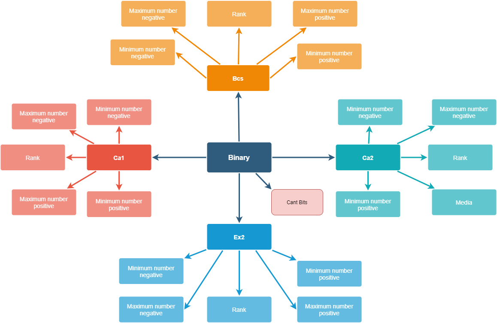
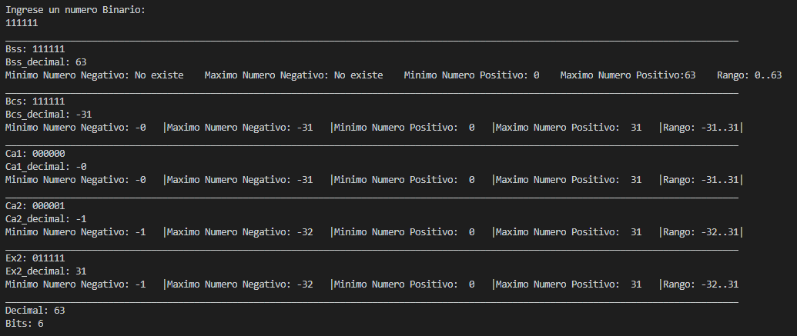
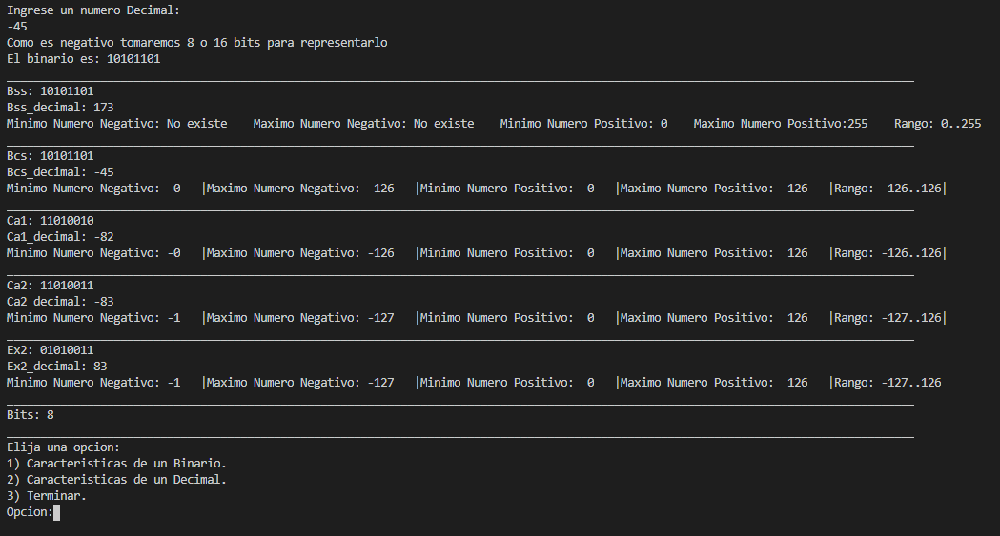

# Calculator-for-OC.

  

## Diagrama.

## Menu

## Ejemplo con un binario que empieza con 1

## Ejemplo con un binario que empieza con 0

## Ejemplo con un decimal positivo

## Ejemplo de un decimal negativo

### Website

Pagina web sobre el repositorio [link](https://fabianmartinez1234567.github.io/Converter-OC/)
